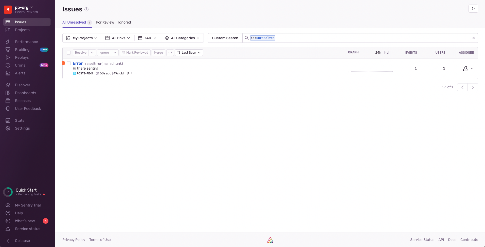

# posts-demo

## Table of Contents

- [posts-demo](#posts-demo)
  - [Overview](#overview)
  - [Table of Contents](#table-of-contents)
  - [Requirements](#requirements)
  - [Installation](#installation)
  - [Usage](#usage)
  - [Testing](#testing)

## Overview

This is a demo repo with a Golang API and a React FE to showcase some functionalities around DevOps frameworks and tools.

The main purpose of this demo aims to demonstrate on how Sentry can be used to track errors in both the API and the FE.

To test it locally please first create a free tier account in Sentry and then replace the `<SENTRY_DSN>` placeholder in the `.env` files with the DSN provided by Sentry for both Golang and React projects.

This demo uses the following tools:
- Sentry for error tracking
- Docker and Docker Compose for containerization
- Make for automation

The Golang backend has the following features:
- CRUD operations for posts [GET, POST, PUT, DELETE]
- MySQL as a database engine
- Gorm for ORM
- Goose for database migrations
- Zap for logging
- UberFx for configuration
- Go modules for dependency management
- Chi for routing
- Swagger for API documentation

The React FE has the following features:
- Axios for API calls
- React Router for routing
- React Bootstrap for UI components
- NGINX as a web server
- Docker multi-stage build for production

## Requirements

- [Golang](https://golang.org/doc/install)
- [NodeJS](https://nodejs.org/en/download/)
- [Docker](https://docs.docker.com/get-docker/)
- [Docker Compose](https://docs.docker.com/compose/install/)
- [Make](https://www.gnu.org/software/make/)
- [Git](https://git-scm.com/downloads)

## Installation

1. Clone the repo:

```bash
git clone https://github.com/pedromspeixoto/posts-demo.git
```

2. Create a `default.env` file for the API:

```bash
cd api
touch default.env
```

Example of the local API `.env` file:

```bash
ENV="development"
APP_PORT="8080"
ALLOWED_HOSTS=*

LOGGER_TYPE="zap"
LOGGER_LEVEL="1"

MYSQL_HOST="0.0.0.0"
MYSQL_PORT="3306"
MYSQL_USER="username"
MYSQL_PASSWORD="password"
MYSQL_DB_NAME="dev_posts"

SENTRY_ENABLED=true
SENTRY_DSN=<SENTRY_DSN>
```

3. Create a `.env` file for the FE:

```bash
cd fe
touch .env
```

Example of the local FE `.env` file:

```bash
NODE_ENV=production
REACT_APP_API_URL=http://localhost:8080
REACT_APP_SENTRY_DSN=<SENTRY_DSN>
```

4. Start both API and FE using the make target:

```bash
make docker-compose-up-local
```

## Usage

- Access the FE at http://localhost, perform any requests and see the performance and errors in Sentry:


- You can also verify that Swagger is running and the API is working by accessing http://localhost:8080/swagger/index.html:


- If you have properly configured sentry, you will be able to see the errors and performance logs in Sentry:




- Also, this allows us to have a full picture of all requests performed in the application with E2E tracing:


## Testing

TBD - Unit, Integration, API and E2E tests will be added in a future release